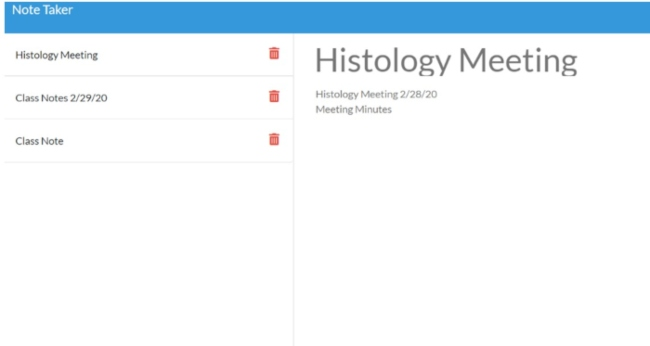

# Digital Notebook

## INTRODUCTION
As a career professional / student I want an app that will save and delete typed notes so that I can keep an organized log of tasks, meeting notes, and homeworks that are due. 

 

## TABLE OF CONTENTS

1. [USAGE](#usage)
2. [FEATURES](#features)
3. [INSTALLATION](#installation)
4. [PREVIEW](#preview)
5. [RESOURCES](#resources)
6. [BADGES](#badges)

 

## USAGE

This application can be used to write, save, and then delete notes created by the user.  

 

## FEATURES
 This application uses express framework as its backend.
 The notes are saved and retrieved from a JSON file. 

1. Users will have the ability to create their own notes with:
    * Header (title)
    *  Body (text)

2. Each note can be saved using the save icon
    *Notes can still be viewed, once clicked on, or after returning to the webpage.

3. Individual notes can be deleted using the trash icon.

 

## INSTALLATION

To run this program install (npm install) the following dependency:

 **Express**: framework for node to aid in creating server-side code

 

### PREVIEW

  

 

### RESOURCES

CSS Framework

***Bootstrap 4:*** https://getbootstrap.com/docs/4.4/getting-started/introduction/

 
Icons

***Font Awesome:*** https://fontawesome.com/icons/save

 
Gif recording

***Screencastify:*** Google extension

 
Badges for Markdown

***Naereen Badges:*** https://github.com/Naereen/badges

 

### BADGES
Please click badge below 

